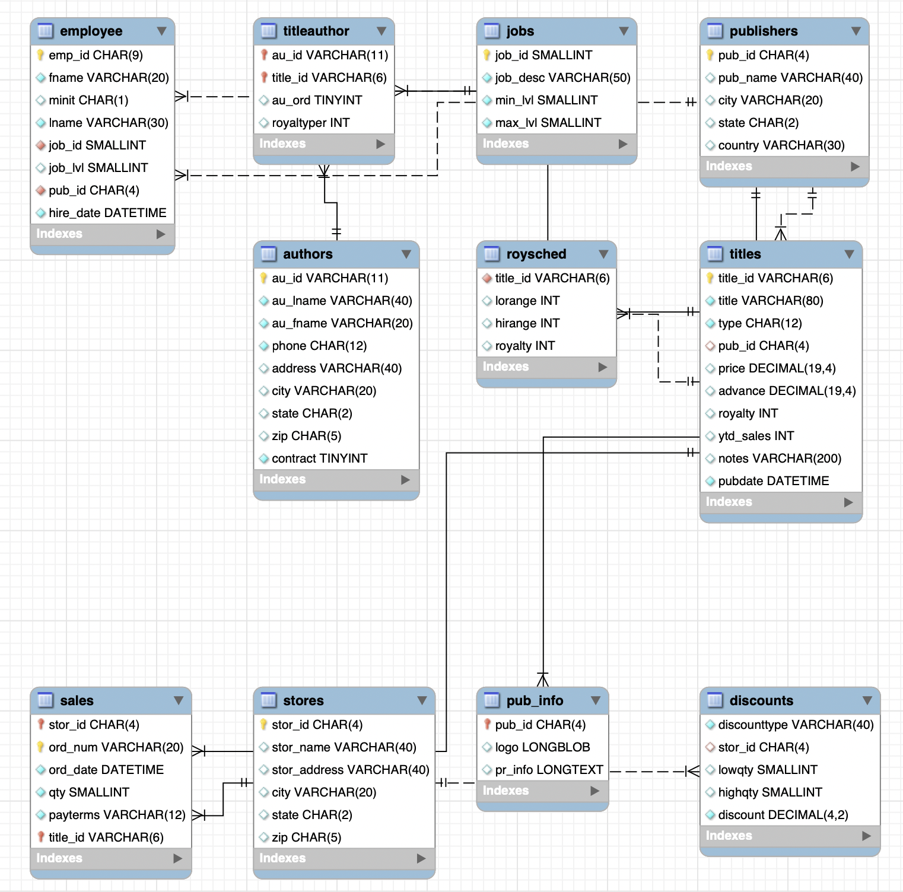

# Lab | MySQL Select

## Introduction

In this lab you will practice how to use the MySQL `SELECT` statement which will be extremely useful in your future work as a data analyst/scientist/engineer. **You will use the `publications` database**. Here is the [link to download the database file](https://s3-eu-west-1.amazonaws.com/ih-materials/uploads/data-static/data/module-1/publications.sql.zip). Use your database management application to query `publications`.

You will create a `solutions.sql` file in the `your-code` directory to record your solutions to all challenges.

You can explore your database and table on your own, but here's a quicker view of how the DB is modeled:

## Challenge 1 - Who Have Published What At Where?

In this challenge you will write a MySQL `SELECT` query that joins various tables to figure out what titles each author has published at which publishers. Your output should have at least the following columns:

- `AUTHOR ID` - the ID of the author
- `LAST NAME` - author last name
- `FIRST NAME` - author first name
- `TITLE` - name of the published title
- `PUBLISHER` - name of the publisher where the title was published

Your output will look something like below:

_Note: the screenshot above is not the complete output._

If your query is correct, the total rows in your output should be the same as the total number of records in Table `titleauthor`.

## Challenge 2 - Who Have Published How Many At Where?

Elevating from your solution in Challenge 1, query how many titles each author has published at each publisher. Your output should look something like below:

_Note: the screenshot above is not the complete output._

To check if your output is correct, sum up the `TITLE COUNT` column. The sum number should be the same as the total number of records in Table `titleauthor`.

_Hint: In order to count the number of titles published by an author, you need to use [MySQL COUNT](https://dev.mysql.com/doc/refman/8.0/en/counting-rows.html). Also check out [MySQL Group By](https://dev.mysql.com/doc/refman/8.0/en/group-by-modifiers.html) because you will count the rows of different groups of data. Refer to the references and learn by yourself. These features will be formally discussed in the Temp Tables and Subqueries lesson._

## Challenge 3 - Best Selling Authors

Who are the top 3 authors who have sold the highest number of titles? Write a query to find out.

Requirements:

- Your output should have the following columns:
  - `AUTHOR ID` - the ID of the author
  - `LAST NAME` - author last name
  - `FIRST NAME` - author first name
  - `TOTAL` - total number of titles sold from this author
- Your output should be ordered based on `TOTAL` from high to low.
- Only output the top 3 best selling authors.

## Challenge 4 - Best Selling Authors Ranking

Now modify your solution in Challenge 3 so that the output will display all 23 authors instead of the top 3. Note that the authors who have sold 0 titles should also appear in your output (ideally display `0` instead of `NULL` as the `TOTAL`). Also order your results based on `TOTAL` from high to low.

## Deliverables

- `solution.sql` that contains all your MySQL queries.

## Submission

- Add `solutions.sql` to git.
- Commit your code.
- Push to your fork.
- Create a pull request to the class repo.

## References

- [MySQL Reference: Counting Rows](https://dev.mysql.com/doc/refman/8.0/en/counting-rows.html)
- [MySQL Reference: Group By](https://dev.mysql.com/doc/refman/8.0/en/group-by-modifiers.html)
- [MySQL Reference: SUM Function](https://dev.mysql.com/doc/refman/8.0/en/group-by-functions.html#function_sum)
